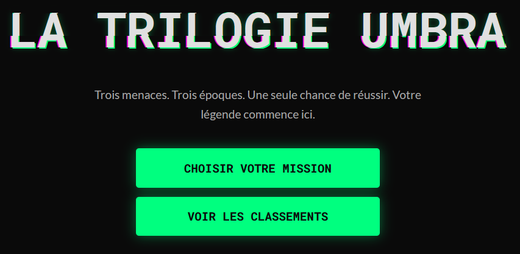
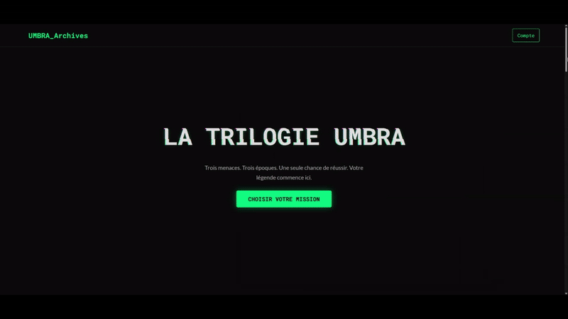

# 🕵️‍♂️ UMBRA-Games

> _Plongez dans une aventure cyber captivante, où hacking, énigmes et suspense s’entremêlent…_

---

## 🌐 Présentation

**UMBRA-Games** est un escape game en ligne immersif, articulé comme une trilogie narrative sur fond de cybercriminalité, piratage informatique et hacking éthique. Enfilez le costume d’un cyber-enquêteur et tentez de déjouer les plans machiavéliques de trois groupes fictifs : **UMBRA**, **CHIMERA** et **PHENIX**.

---

## 🚦 Scénario

🌑 **UMBRA**  
La menace initiale, un groupe de hackers insaisissable.  
🔥 **CHIMERA**  
L’organisation qui manipule l’ombre… et la lumière.  
🦅 **PHENIX**  
La renaissance du chaos, l’ultime épreuve.

Chaque épisode offre des énigmes uniques, des mécaniques originales et une immersion progressive dans l’univers cyber, où le danger rôde derrière chaque ligne de code.

---

## ✨ Fonctionnalités clés

- **Trilogie scénarisée** : 3 aventures connectées pour une expérience complète.
- **Création & gestion de compte** : Suivi personnalisé de votre progression.
- **Hub centralisé** : Accès simplifié à tous les épisodes et vos informations.
- **Progression sauvegardée** : Reprenez votre partie où vous l'avez laissée.
- **Interface responsive** : Jouez sur ordinateur, tablette ou mobile.
- **Ambiance visuelle & sonore** : Plongée garantie dans le monde du hacking.
- **Aucune installation requise** : Accessible 100% en ligne.

---

## 🚀 Accès rapide

> **Essayez-le dès maintenant :**  
> [🌍 https://umbra-games.x10.mx](https://umbra-games.x10.mx)

---

## 🖼️ Aperçu du hub

> _Page d’accueil centralisant la trilogie et vos accès_

---

## 📚 Comment jouer ?

1. **Créez un compte** pour sauvegarder votre progression.
2. **Lancez le premier épisode** et laissez-vous guider par le scénario.
3. **Résolvez les énigmes** en utilisant logique, observation et réflexion.
4. **Débloquez les épisodes suivants** au fil de votre enquête.
5. **Surpassez-vous** pour arrêter UMBRA, CHIMERA et PHENIX !

---

## 🛠️ Technologies utilisées

- **PHP** (backend)
- **HTML5** / **CSS3** (structure & styles)
- **JavaScript** (interactivité)
- **Responsive Design**

---

## 👤 Auteur

**DAHORD**

- Concept original, direction créative, architecture & développement
- Près de 150 heures de travail passionné

---

## 💡 Contribution

Toute suggestion, retour ou contribution est la bienvenue !  
Pour participer :

- Créez une issue ou une pull request
- Contactez l’auteur pour des propositions majeures

---

## 📄 Licence

Projet distribué sous licence **GNU GPL**.  
Voir le fichier [LICENSE](LICENSE) pour plus d’informations.

---

  <b>Merci pour votre intérêt et bon jeu !</b> 
  <i>Vous pensez avoir l’âme d’un hacker ? À vous de jouer…</i>

